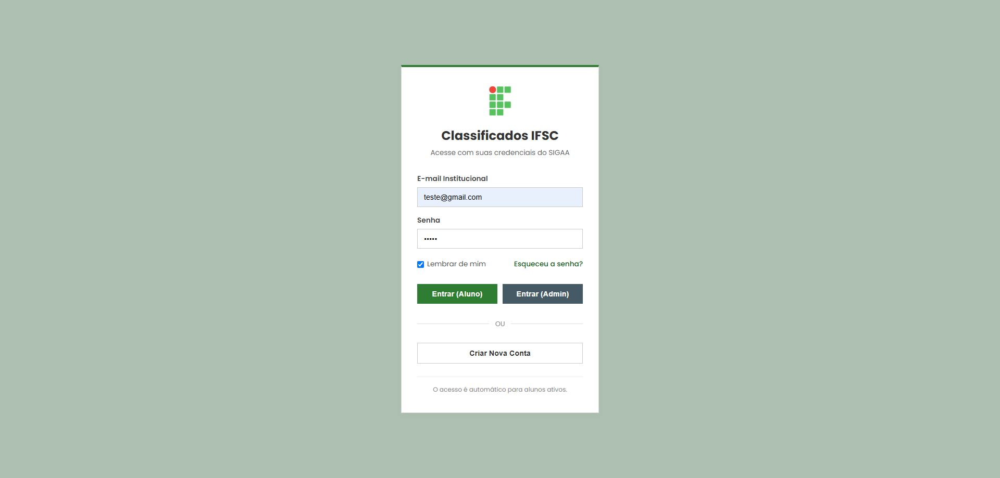
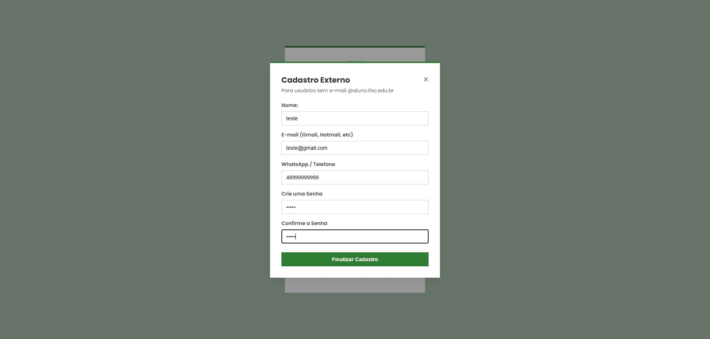
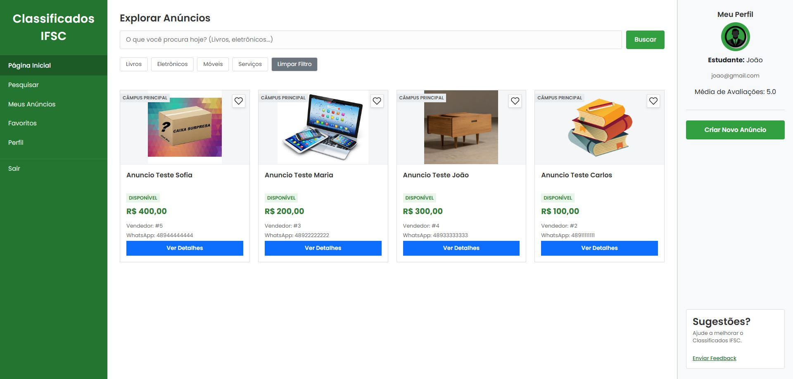
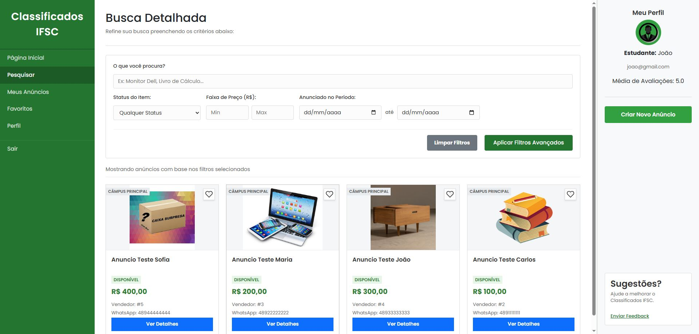
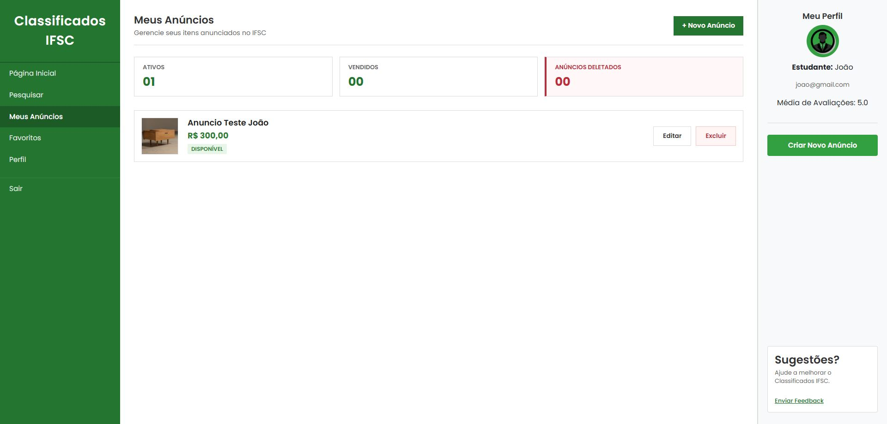
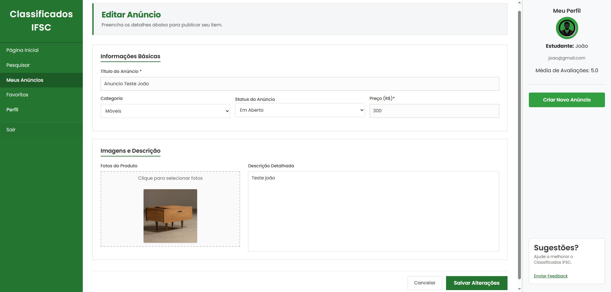
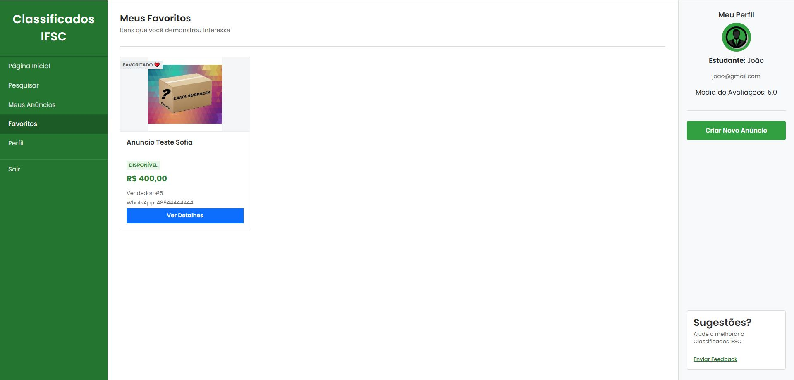
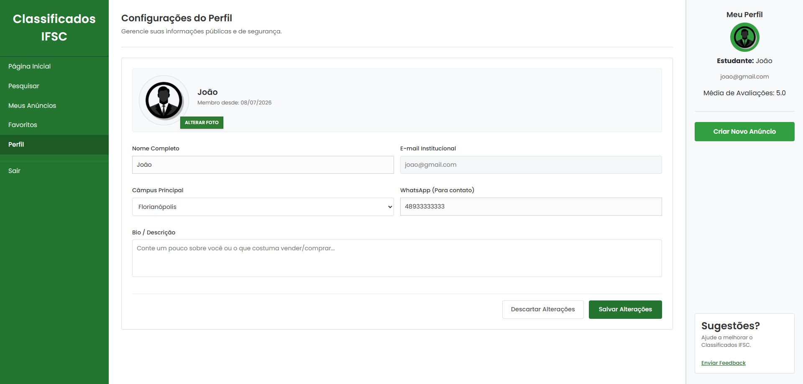
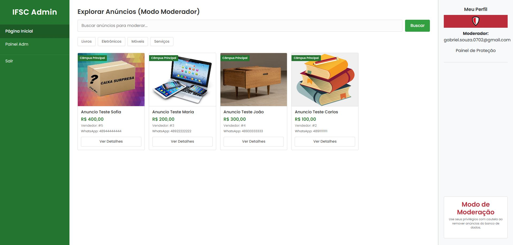
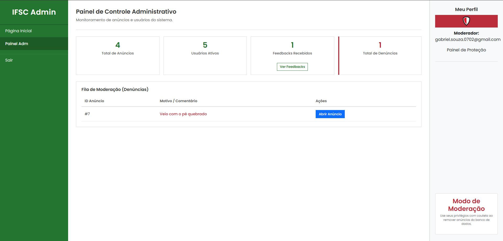

<h1 style="text-align: center"> Classificados IFSC </h1>

<h4> Este sistema consiste em um website para realizar <u>Anúncios</u> de produtos entre os estudantes do IFSC, permitindo que o campus se integre ainda mais e conecte seus alunos através desta ideia  
O sistema também possui uma dinâmica de <u>Administrador</u> (os quais no momento são os desenvolvedores do projeto). Estes são responsáveis pelo monitoramento do servidor e do controle de seu funcionamento, assim como vigília sobre as ações dos usuários ativos.</h4>

<h1 style="text-align: center"> Funcionalidades </h1>
<h3> Para seu uso completo e apropriado à sua finalidade, o sistema dispôe das seguintes funcionalidades: </h3>

<b>Para Aluno:</b>

<ul> 
  <li><b>Pesquisa</b> de anúncios por filtros específicos</li>
  <li><b>Cadastro</b> e <b>Edição</b> de anúncios</li>
  <li>Possibilidade de <b>Avaliar</b>, <b>Favoritar</b> e <b>Denunciar</b> anúncios (este acompanhado de uma mensagem feita pelo denunciante)</li>
  <li><b>Contato</b> direto com os anunciantes através de <b>WhatsApp</b> (Presente em "Detalhes")</li>
  <li>Alterar seu <b>Perfil</b> e informações de Cadastro</li>
</ul>

<b>Para Administrador:</b>

<ul> 
  <li>Visão Geral dos Anúncios</li>
  <li><b>Pesquisa</b> de anúncios por filtros específicos</li>
  <li><b>Controle</b> do sistema através do <b>Painel Adm</b>, que inclui:
    <ul>
      <li>Total de Anúncios</li>
      <li>Usuários Ativos</li>
      <li>Feedbacks Recebidos</li>
      <li>Total de Denúncias</li>
    </ul>
  </li>
  <li><b>Deletar</b> o anúncio de algum aluno, seja através da <b>Página Inicial</b> ou <b>Painel Adm</b>, acompanhado de uma mensagem para justificativa, que chegará ao aluno</li>
</ul>

<h1 style="text-align: center"> Telas </h1>
<h3> Para melhor entendimento das funções mencionadas anteriormente, segue abaixo uma visão geral das telas para realização delas </h3>

<h3>1 - Telas Gerais</h3>
<h4>1.1 - Tela de Login</h4>

<h4>1.2 - Tela de Cadastro</h4>

<h3>2 - Telas do Aluno</h3>
<h4>2.1 - Página Inicial</h4>

<h4>2.2 - Pesquisar</h4>

<h4>2.3 - Meus Anúncios</h4>

<h4>2.3.1 - Novo Anúncio/Editar Anúncio</h4>

<h4>2.4 - Favoritos</h4>

<h4>2.5 - Perfil</h4>

<h3>3 - Telas do Administrador</h3>
<h4>3.1 - Página Inicial</h4>

<h4>3.2 - Painel Adm</h4>

Ainda Não Finalizado!!

